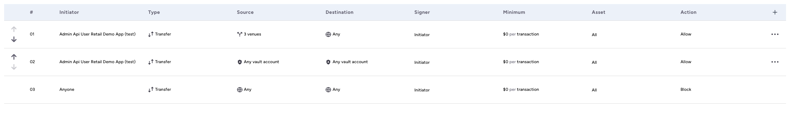
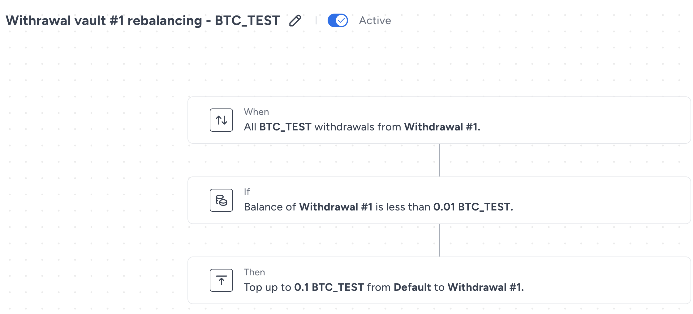

<p align="center">
  
</p>
<div align="center">

[Fireblocks Developer Portal](https://developers.fireblocks.com) </br>
[Fireblocks Sandbox Sign-up](https://www.fireblocks.com/developer-sandbox-sign-up/) <br/><br/>

  <h1> Fireblocks Retail App Demo </h1>
</div>
<br/>

> :warning: **Warning:**
> This code is intended solely as a reference and is **NOT** production-ready.
> It should not be used directly in a production environment.
> Fireblocks assumes no responsibility for any financial loss or other damages resulting from the use of this code in production.\*\*

## Fireblocks Retail Demo Application - Work in Progress!

The Fireblocks Retail Demo application is designed to support Fireblocks clients by serving as a reference model for their integration processes. It embodies the best practices that Fireblocks advocates for building secure, retail-facing solutions.

This demo aims to accelerate and simplify the integration of Fireblocks into your projects, ensuring that you adhere to the recommended best practices when building on the Fireblocks platform.

### Overview

- **Frontend**: Built with Next.js, this frontend application serves as a retail cryptocurrency platform, providing features like portfolio dashboards, multi-asset wallet management, and transaction handling. It leverages Fireblocks for secure asset management, offering a comprehensive example of a retail-facing crypto solution.
- **Backend**: Developed with Node.js (Express.js), the backend handles essential operations such as user authentication, wallet and asset management, and transaction processing. It integrates with a MySQL database to store user data locally and communicates with the Fireblocks API for wallet and transaction operations.

---

### Before you start: Fireblocks workspace configurations:

#### **Fireblocks testnet workspace setup**

- Running the retail demo app requires a Fireblocks testnet workspace. Complete activating your workspace with the workspace Owner before proceeding with this guide.
- [Create an API user](https://support.fireblocks.io/hc/en-us/articles/4407823826194-Adding-new-API-Users) to execute the backend processes. Our implementation requires a single API user with signing privileges to simplify the integration, for a production-grade application please consider these [best practices](https://developers.fireblocks.com/docs/manage-api-keys) when creating your API users and access levels.
- Upload the `fireblocks-secret.key` file to the `keys` folder on the backend root project folder (create one if not yet created).
- Complete the API user setup and the pairing to an API Co-Signer.
- Copy the API user ID from the console UI and update it in your `.env` file of the backend library (more details below).
- Enable [One Time Address (OTA)](https://support.fireblocks.io/hc/en-us/articles/4409104568338-One-Time-Address-OTA-feature) to allow user withdrawals.
- Determine your Omnibus vault account and copy its ID (found on the vault account page URL) and update your `.env` file in the backend library (more details below).
- Create your withdrawal vault accounts and update their IDs in the `.env` file.
  Note: If not manually set in the `.env` file, the app will create the omnibus and 3 withdrawal vault accounts, and update the database accordingly on the initial run of the app.

#### **Transaction Authorization Policy (TAP) setup**

Our retail demo app uses the Fireblocks [TAP](https://support.fireblocks.io/hc/en-us/articles/7354983580316-About-the-TAP) feature to govern the flow of assets between vault accounts and from the withdrawals accounts to external user wallets.
Use the below example to tailor your policy and update it on your testnet workspace.
This simplified TAP rule set dictates that the API Admin user will be able to perform rebalancing and sweeping transactions (any vault account to any vault account), and perform user withdrawal transactions (from the 3 withdrawal vault accounts to OTAs).



Note: This TAP example is a very simplified rule set that only shows the bare minimum rules required for the demo app to run smoothly. For production level apps, please consider hardening your policy as required by your operations.

#### **Test coins funding**

In order to run the demo app, an initial deposit of test coins is required to the withdrawal vault accounts.
Please fund your withdrawal vault accounts with the sufficient balance of tokens and according to the supported assets list found [here](./backend/src/utils/supportedAssets.json).

Optional public faucets to use:

[Bitcoin Test tokens](https://bitcoinfaucet.uo1.net/)

[Sepolia Test tokens](https://www.alchemy.com/faucets/ethereum-sepolia)

[Solana Devnet tokens](https://faucet.solana.com/)

#### **Webhooks setup**

The retail demo app listens to webhooks from Fireblocks and triggers business operations and database updates based on specific events, follow this guide to properly configure your environment to receive webhook messages from Fireblocks.

- Configure a local tunneling service like `ngrok` or `exposed` and forward the messages to `http://localhost:3000`.
- Copy the publicly available URL of the tunneling service.
- [Configure](https://support.fireblocks.io/hc/en-us/articles/4408110107794-Configuring-webhook-URLs) the URL as a webhook server on your Fireblocks testnet workspace's general settings.
- **Important:** the app's webhook endpoint is configured on the `./webhook` path, make sure you add it to the public URL provided by the local tunneling tool you use (example: `https://1e70-94-188-131-83.ngrok-free.app/webhook`).

#### **Rebalancing Automation**

The retail demo app utilizes Fireblocks's [Automations feature](https://support.fireblocks.io/hc/en-us/articles/14873112741660-Automation) to trigger rebalancing transactions from the omnibus vault account (where all user deposit accumulates) to the withdrawal vault accounts.
Below you will find an example of an automation created to facilitate the above, use it as reference when creating your automations.



Explanation:

- This automation will be triggered by any BTC_TEST withdrawal from withdrawal vault #1.
- Once the withdrawal is completed, the remaining balance of BTC_TEST in that vault will be checked.
- If the remaining balance is lower than 0.01 BTC_TEST, a rebalancing transaction will be triggered to top-up the balance up to 0.1 BTC_TEST.

Notes:

- An automation should be created for **each** supported asset on **every** withdrawal vault account.
- The amounts used above should be changed based on the anticipated operation in your app.

---

### Running the application:

The retail demo app can run with Docker or locally, both options require updating the environment variable files for both the backend and frontend servers.

#### **Backend enviroment variables**

Note: You may use the [.env.example](./backend/.env.example) file as reference.
Here's a detailed explanation of each variable:

#### Database Configuration

- `DB_NAME`: Name of the MySQL database (default: retail_demo)
- `DB_USER`: MySQL user (default: root)
- `DB_PASSWORD`: MySQL password
- `DB_HOST`: Database host (default: localhost)
- `DB_PORT`: Database port (default: 3306)

#### Authentication

[Google OAuth 2.0 docs](https://developers.google.com/identity/protocols/oauth2)

- `GOOGLE_CLIENT_ID`: Google OAuth client ID
- `GOOGLE_CLIENT_SECRET`: Google OAuth client secret
- `GIT_CLIENT_ID`: GitHub OAuth client ID
- `GIT_CLIENT_SECRET`: GitHub OAuth client secret
- `JWT_SECRET_KEY`: Secret key for JWT token generation
- `JWT_REFRESH_KEY`: Secret key for JWT refresh token generation

#### Fireblocks Configuration

- `FIREBLOCKS_API_KEY`: Your Fireblocks API key
- `FIREBLOCKS_PATH_TO_SECRET`: Path to your Fireblocks secret key file

#### Application Settings

- `PORT`: Port on which the server will run (default: 3000)
- `FRONTEND_BASE_URL`: URL of the frontend application

#### Vault Configuration

- `OMNIBUS_VAULT`: ID of the Omnibus vault in Fireblocks
- `WITHDRAWAL_VAULTS`: Comma-separated IDs of withdrawal vaults in Fireblocks

#### **Frontend enviroment variables**

- `NEXT_PUBLIC_BACKEND_BASE_URL`=http://localhost:3000
- `CMC_API_KEY`=your_coinmarketcap_api_key

You can get your CMC API key [here](https://coinmarketcap.com/api/documentation/v1/) - we use it as USD value oracle for the app.

#### **Run with Docker:**

Prerequisites:

- Install Docker and Docker Compose.
- Updating the `.env` files for bth servers as mentioned above.

1. Build the Docker image:

   ```
   docker build -t fireblocks-retail-demo .
   ```

2. Run the Docker container:
   ```
   docker-compose up
   ```
3. Navigate to `http://localhost:3001/login` once the container is up and running to access the app console UI.

#### **Run locally:**

Prerequisites:

- Install MySQL.
- Install the BE dependencies:

```
npm install --prefix ./backend
```

- Install the FE dependencies:

```
npm install --prefix ./frontend
```

1. Run the backend server:

```
cd backend
npm start
```

2. Run the frontend server: (on another terminal)

```
cd frontend
npm run dev
```

3. Navigate to `http://localhost:3001/login` to access the app console UI.

---

### Setup script:

The setup script will run only the first time you start the app. It will initialize the connection to the database, create the tables and configure the default data fields.

The setup script uses the `OMNIBUS_VAULT` and `WITHDRAWAL_VAULTS` variables to determine whether to create new vault accounts or use existing ones:

1. If `OMNIBUS_VAULT` is empty:

   - The script will create a new vault account in Fireblocks called "Omnibus Vault".
   - It will then create a BTC_TEST wallet in this vault account.

2. If `OMNIBUS_VAULT` contains a value:

   - The script will use the provided vault ID as the Omnibus vault.
   - It will not create a new vault account in Fireblocks.

3. If `WITHDRAWAL_VAULTS` is empty:

   - The script will create three new vault accounts in Fireblocks named "Withdrawal Vault #1", "#2", and "#3".
   - It will create SOL_TEST, ETH_TEST5, and BTC_TEST wallets in each of these vault accounts.

4. If `WITHDRAWAL_VAULTS` contains a comma-separated list of vault IDs:
   - The script will use these IDs as the withdrawal vaults.
   - It will not create new vault accounts in Fireblocks.

This flexibility allows you to either use existing vault accounts or let the application create new ones. If you're using existing vault accounts, make sure to set the appropriate IDs in the .env file before running the application for the first time.
**Important:** The setup script runs only once when the database is empty. If you need to re-run the setup, you'll need to clear the existing data from the database.

---

### Backend Application Details

This backend application showcases how to integrate Fireblocks' services into a typical retail-facing scenario. Key features include:

- User authentication (supports Local, Google, and GitHub)
- Wallet creation and management
- Asset creation and balance tracking
- Transaction processing
- WebSocket integration for real-time updates
- Integration with Fireblocks API for vault account and transaction management

For more detailed information, please refer to the [Backend README](./backend).

---

### Frontend Application Details

The frontend, named **FireX**, is a retail cryptocurrency demo platform built with Next.js and MobX, and integrated with Fireblocks for secure asset management. This project serves as a comprehensive reference for integrating Fireblocks into retail-facing applications.

**FireX** includes features such as a portfolio dashboard, multi-asset wallet management, and a transaction system with Fireblocks integration for secure transfers.

For more detailed information, please refer to the [Frontend README](./frontend).

---

## License

This project is licensed under the MIT License - see the LICENSE.md file for details.
